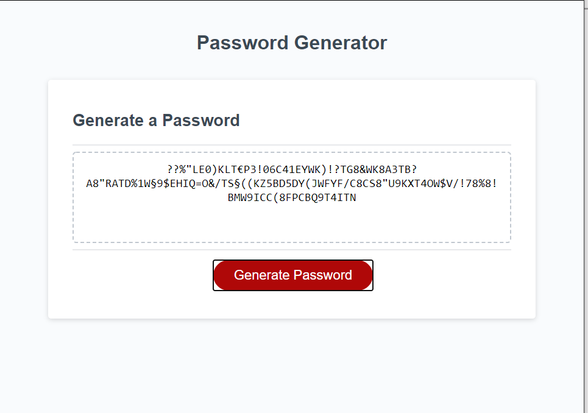

### Project Name 
# Password Generator asdf 

## Description
Password generation program that allows you to choose several different parameters for the password to be created.  
## Table of Contents  
- [Description](#description)
- [Installation](#installation)
- [Usage](#usage)
- [Contributing](#contributing)
- [Tests](#tests)
- [License](#license)
- [Questions](#questions)  
## Media
  
## Installation  
clone repository and run "npm install"
## Usage
Click "Generate Password" and follow the prompts to create a new random password.

This application is covered under the AGPLv3 license.

## Questions
Please send questions or inquiries to: 
